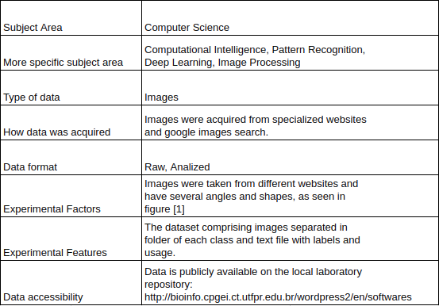

# UTFPR-CMMD - Federal University of Technology - Paraná - Car Make and Model Dataset

## Image dataset for car make and model recognition

This dataset was created for car make and model recognition in static images. We provide annotated images for multiclass classification obtained from specialized websites and google images. The data have 25000 images split into 50 different classes at the level of Make and Model.

## Specifications Table

## Value of the data

* There are very few datasets especially devised for recognition of car make and model. This dataset contains images of the 50 best selling cars in Brazil in the year of 2018 and contains about 500 instances per class. In the future it is expected to increase the number of classe to cover the majority of vehicles used in Brazil.

* Recognition of car make and model is very important for publicly security, a powerful classifier can reduce labor cost in and increase the efficiency of real-time security cameras.

* Our dataset has images of different types that can increase the robustness of the classifier.

## Data

Data were collected ourselves from vehicle specialized websites that can generaly be images from publicity in a controlled behavior as also have images acquired from images on google images that can be of the more diversily state.

## Sample images from UTFPR-CMMD

## Links to the data
[UTFPR-CMMD]()
###https://drive.google.com/file/d/1C3mXMpItQgctGALu7cGMAmeOShXdzIOY/view?usp=sharing

## Acknowledgments

## Publications:

